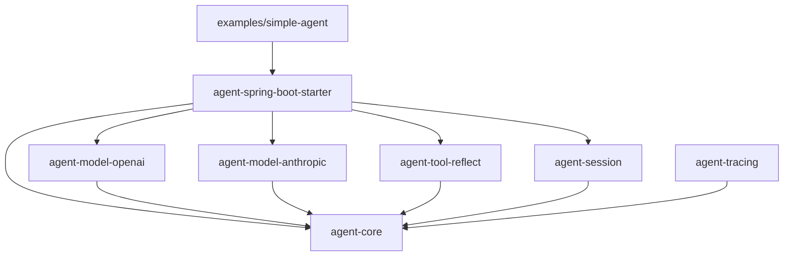

# Java Agents

Java Agents 是面向 Java 17 和 Spring Boot 3 的轻量级 Agent Runtime。它提供 Agent 定义、模型调用、函数工具执行、任务移交与护栏契约、会话存储、追踪和
Spring Boot 自动配置。

当前内置两个模型适配器：

- OpenAI Responses API；
- Anthropic Messages API。

`Runner` 与模型提供商解耦，可以在一次运行内完成“模型请求 → 工具调用 → 工具结果回传 → 最终文本”的循环。

> 实现参考：[openai-agents-python](https://github.com/openai/openai-agents-python)

## 环境要求

- JDK 17；
- Maven；
- 调用真实模型时所需的 API Key；
- 可选的 `curl`，用于调用 HTTP 示例。

```bash
java -version
mvn -version
```

以下命令均在仓库根目录执行。

## 项目结构

```text
agent-java/
├── agent-core/                 # Agent Runtime 核心契约与 Runner
├── agent-model-openai/         # OpenAI Responses API 适配器
├── agent-model-anthropic/      # Anthropic Messages API 适配器
├── agent-tool-reflect/         # 注解式 Java 方法工具
├── agent-session/              # 内存和 PostgreSQL 会话存储
├── agent-tracing/              # Span 与追踪导出接口
├── agent-spring-boot-starter/  # Spring Boot 自动配置
├── examples/simple-agent/       # OpenAI + 反射工具 HTTP 示例
└── pom.xml                      # Maven 父项目
```

| 模块                                                          | 主要职责                                            | 关键类型                                                                  |
|-------------------------------------------------------------|-------------------------------------------------|-----------------------------------------------------------------------|
| [`agent-core`](agent-core/)                                 | Agent、运行器、模型、工具、护栏、会话、追踪和任务移交契约                 | `Agent`、`Runner`、`ModelClient`、`Tool`、`TraceExporter`                 |
| [`agent-model-openai`](agent-model-openai/)                 | OpenAI Responses API 请求、文本解析、工具调用与 continuation | `OpenAIModelClient`                                                   |
| [`agent-model-anthropic`](agent-model-anthropic/)           | Anthropic Messages API 请求、内容块解析、工具调用与消息续传       | `AnthropicModelClient`                                                |
| [`agent-tool-reflect`](agent-tool-reflect/)                 | 从 Java 方法生成工具、参数 Schema 和返回字段说明                 | `ReflectionToolFactory`、`AgentTool`、`ToolParam`、`ToolResultField`     |
| [`agent-session`](agent-session/)                           | JVM 内、PostgreSQL 和 MySQL 会话消息存储                 | `InMemorySessionStore`、`PgSessionStore`、`MysqlSessionStore`           |
| [`agent-tracing`](agent-tracing/)                           | 追踪导出实现                                          | `LogTraceExporter`                                                    |
| [`agent-spring-boot-starter`](agent-spring-boot-starter/)   | 默认 OpenAI 客户端、Runner 和配置绑定                      | `AgentsAutoConfiguration`、`AgentsProperties`                          |
| [`examples/simple-agent`](examples/simple-agent/)           | OpenAI 客户端、Spring 工具扫描和 HTTP 入口                 | `SimpleAgentApplication`、`AgentsConfiguration`、`TestTool`             |



## 快速开始

### 1. 构建项目

```bash
mvn clean install
```

该命令编译全部模块、运行测试，并把 `0.1.1-SNAPSHOT` 构件安装到本地 Maven 仓库。

### 2. 配置并启动示例

示例应用当前显式注册 `OpenAIModelClient`。它通过 `AgentsProperties` 读取 OpenAI 配置：

```bash
export OPENAI_API_KEY="your-openai-api-key"
export OPENAI_MODEL="gpt-4.1-mini" # 可选
export OPENAI_BASE_URL="https://api.openai.com/v1/responses" # 可选，覆盖默认完整 API 地址
mvn -f examples/simple-agent/pom.xml spring-boot:run
```

应用默认监听 `8080`。`OPENAI_MODEL` 未设置时使用 `gpt-4.1-mini`。

### 3. 调用 Agent

浏览器访问 [http://127.0.0.1:8080/](http://127.0.0.1:8080/)，可使用内置调试页面进行多轮对话，并查看
`sessionId`、`runId`、轮次、请求耗时和最近一次原始响应。

也可以直接调用接口：

```bash
curl -X POST http://localhost:8080/agents/run \
  -H 'Content-Type: application/json' \
  --data '{"input":"查询新闻列表，再介绍第一条新闻","sessionId":"demo-session"}'
```

示例会把 `TestTool` 中的 `get_news` 和 `news_detail` 注册给 Agent。模型可以发起工具调用，Runner 执行工具并继续请求模型。HTTP 响应为：

```json
{
  "finalOutput": "...",
  "runId": "550e8400-e29b-41d4-a716-446655440000",
  "sessionId": "demo-session",
  "turns": 1,
  "usage": {
    "inputTokens": 120,
    "outputTokens": 35,
    "totalTokens": 155,
    "cachedInputTokens": 64,
    "reasoningTokens": 12
  }
}
```

`runId` 是每次运行生成的 UUID。`turns` 是实际模型调用次数；`usage` 累计本次运行全部模型调用（包括工具续传和达到轮次上限后的收尾请求）的
token 用量。供应商未返回用量时，对应字段为 `0`。

## 在 Java 中使用

### 依赖

先执行 `mvn clean install`。普通 Java 应用至少依赖核心模块和一个模型适配器：

```xml
<dependencies>
    <dependency>
        <groupId>com.ariza.agent</groupId>
        <artifactId>agent-core</artifactId>
        <version>0.1.1-SNAPSHOT</version>
    </dependency>
    <dependency>
        <groupId>com.ariza.agent</groupId>
        <artifactId>agent-model-openai</artifactId>
        <version>0.1.1-SNAPSHOT</version>
    </dependency>
</dependencies>
```

如需 Anthropic，将第二个 artifactId 换成 `agent-model-anthropic`。

### 定义并运行 Agent

```java
import com.ariza.agent.core.Agent;
import com.ariza.agent.core.RunResult;
import com.ariza.agent.core.Runner;
import com.ariza.agent.core.model.ModelClient;
import com.ariza.agent.openai.OpenAIModelClient;

public class AgentExample {
    public static void main(String[] args) {
        ModelClient modelClient =
                new OpenAIModelClient(System.getenv("OPENAI_API_KEY"));

        Agent agent = Agent.builder()
                .name("Assistant")
                .instructions("You are a helpful assistant.")
                .model("gpt-4.1-mini")
                .build();

        RunResult result = new Runner(modelClient).runAgent(agent, "介绍 Java Agent Runtime");
        System.out.println(result.finalOutput());
    }
}
```

`Agent` 的 `name`、`instructions` 和 `model` 不能为空。`tools`、`handoffs`、`guardrails` 未设置或传入 `null` 时会转换为空的不可变列表。

`Runner` 默认 `maxTurns` 为 `10`，也可以设置正整数上限。达到上限仍有工具调用时，Runner
会额外发起一次禁用工具的收尾请求，让模型基于已有信息生成最终答复；模型请求未知工具时会失败。

## 工具调用

### Runner 执行流程

1. 创建本次运行唯一的 `RunContext`；
2. 把用户文本、Agent 指令、模型名和工具定义交给 `ModelClient`；
3. 模型返回工具调用时，按工具名查找并执行 `Tool`；
4. 把成功结果或失败说明包装为 `ToolOutput`；
5. 携带同一 `RunContext` 和提供商 continuation 再次调用模型；
6. 模型返回纯文本后生成 `RunResult`。

工具失败不会立即终止循环，Runner 会把 `工具执行失败: ...` 返回给模型。找不到工具会抛出异常；达到 `maxTurns`
后的收尾请求不再声明任何工具，并要求模型不要向用户暴露内部轮次限制。该请求计入 `RunResult.turns`，如果模型未生成总结文本，则保留此前已有文本。

### 用注解声明工具

添加反射工具模块：

```xml
<dependency>
    <groupId>com.ariza.agent</groupId>
    <artifactId>agent-tool-reflect</artifactId>
    <version>0.1.1-SNAPSHOT</version>
</dependency>
```

```java
import com.ariza.agent.core.RunContext;
import com.ariza.agent.tool.reflect.AgentTool;
import com.ariza.agent.tool.reflect.ToolFieldFormat;
import com.ariza.agent.tool.reflect.ToolParam;
import com.ariza.agent.tool.reflect.ToolResultField;

public final class NewsTools {
    @AgentTool(name = "news_detail", description = "查询新闻详情")
    public News detail(
            @ToolParam(value = "title", description = "新闻标题") String title,
            RunContext context) {
        context.attributes().put("lastTitle", title);
        return new News(title, "正文");
    }

    public record News(
            @ToolResultField(description = "标题", hasValue = true) String title,
            @ToolResultField(
                    description = "发布时间",
                    format = ToolFieldFormat.DATE_TIME) String publishedAt) {
    }
}
```

```java
var tools = new ReflectionToolFactory().create(new NewsTools());
var agent = Agent.builder()
        .name("News assistant")
        .instructions("按需查询新闻")
        .model("claude-sonnet-4-20250514")
        .tools(tools)
        .build();
```

规则如下：

- `@AgentTool.description` 必填；`name` 为空时使用方法名；
- 除未标注的 `RunContext` 外，每个参数都必须使用 `@ToolParam`；
- `required = false` 的参数不能使用 Java 基本类型；
- 参数会生成 `additionalProperties: false` 的 JSON Schema；
- 普通返回值由 Jackson 转为 JSON；方法也可以直接返回 `ToolResult`；
- `@ToolResultField` 可声明说明、必有值、格式和允许值；生成的返回 JSON Schema 会追加到工具说明中；
- `ToolFieldFormat` 支持日期时间、URI、邮箱、IP、UUID、数值和二进制等常用格式。

`examples/simple-agent` 会扫描 Spring 容器中包含 `@AgentTool` 方法的 Bean，并检查跨 Bean 的工具名重复。该扫描逻辑位于示例的 `AgentsConfiguration`，不是 Starter 自动配置的一部分。

## 模型适配器

### OpenAI

`OpenAIModelClient` 默认调用 `https://api.openai.com/v1/responses`，支持：

- Responses API 文本输出；
- function 工具定义和工具调用解析；
- 通过 response id continuation 回传工具结果；
- 非 2xx、无效响应和中断处理。

```java
ModelClient client = new OpenAIModelClient(System.getenv("OPENAI_API_KEY"));
```

### Anthropic

`AnthropicModelClient` 默认调用 `https://api.anthropic.com/v1/messages`，支持：

- Messages API 文本内容块；
- 客户端工具定义、`tool_use` 解析及并行 `tool_result` 回传；
- 通过原生消息历史 continuation 继续对话；
- 停止原因、缓存 token、推理 token、非 2xx、无效响应和中断处理。

```java
ModelClient client = new AnthropicModelClient(System.getenv("ANTHROPIC_API_KEY"));
```

默认 `max_tokens` 为 `4096`，也可通过 `new AnthropicModelClient(apiKey, maxTokens)` 配置。

两个客户端都提供可注入 `URI`、`HttpClient` 和 `ObjectMapper` 的构造器，便于自定义 endpoint 和测试。API Key 不能为空。

## Spring Boot 集成

```xml
<dependency>
    <groupId>com.ariza.agent</groupId>
    <artifactId>agent-spring-boot-starter</artifactId>
    <version>0.1.1-SNAPSHOT</version>
</dependency>
```

Starter 通过 `@ConditionalOnMissingBean` 提供：

- `ModelClient`：默认是 `OpenAIModelClient`；
- `SessionStore`：默认是 `InMemorySessionStore`；
- `Runner`：使用容器中的 `ModelClient` 和 `SessionStore`，并注册为 `Runner.run(...)` 的静态默认客户端。

```yaml
agents:
  ai:
    api-key: ${OPENAI_API_KEY:}
    default-model: gpt-4.1-mini
    endpoint: ${OPENAI_BASE_URL:}
  session:
    type: memory
```

`default-model` 只是类型安全配置属性，Starter 不会自动创建 Agent。应用应自行读取并写入 `Agent.model`。`endpoint`
可选，用于覆盖 Starter 默认创建的 OpenAI 客户端地址；自行注册 Anthropic 客户端时，可通过其构造器覆盖 API 地址。

注册自己的 `ModelClient` Bean 即可替换 OpenAI 默认实现。示例显式注册 `OpenAIModelClient`。如果应用同时自定义 `Runner`
，需要自行决定是否调用 `Runner.setDefaultModelClient`；实例方法 `runAgent` 不依赖静态默认客户端。

未配置 `agents.ai.api-key` 或配置为空白时，Starter 不会创建默认 `OpenAIModelClient` 和 `Runner`，应用仍可正常启动。此时可以自行注册
`ModelClient` Bean，Starter 会基于该客户端创建默认 `Runner`。

### 接入与性能建议

引入 `agent-spring-boot-starter` 后，建议将 Agent 当作受约束的业务编排器，不要让模型自由探索全部工具。对延迟敏感的查询接口，可参考以下做法：

- 为不同任务创建专用 `Agent`，从 `AgentTools.getTools()` 中只筛选必需工具。工具越多，模型的选择成本、误调用和额外轮次风险越高。
- 在 `instructions` 中明确业务路由、工具调用上限和终止条件。例如影像检索应直接且仅调用一次主查询工具，工具返回后直接总结，避免“先查卫星、再查传感器、最后查数据”的串行链路。
- 区分“系列级意图”和“具体型号条件”。用户只说“高分卫星”时，应传递卫星系列或前缀条件，由业务查询层扩展匹配传感器；只有用户明确指定卫星或传感器时，才调用元数据工具精确补全，不应让模型猜测传感器。
- 对 JSON 等结构化输出同时做“提示词约束 + 服务端校验”。在指令中写明数组、枚举、日期等字段的精确类型，反序列化前仍要对常见偏差做兼容转换并拒绝无法识别的值。模型输出始终应视为不可信输入。
- 复用 Starter 注册的单例 `ModelClient`、`Runner` 和 `SessionStore`，不要在每个请求中重复创建。如果子任务不需要会话历史，传入
  `null` sessionId，避免污染主会话。
- 使用 `RunContext.attributes()` 传递“是否命中数据”、候选记录等本次运行的中间状态，后处理直接复用，避免为生成链接、标题或提示文案重复查询。
- 相互独立的后处理可并行执行，确定性操作优先用 Java 实现。例如标题截断、URL 编码和固定链接生成不需要再调用一次模型；确需模型挑选候选项时，应限制候选数量并校验返回的
  ID 必须来自候选集。
- SSE 接口应在独立线程中执行 Agent，必要时显式传递请求上下文。可通过装饰 `Tool` 统一上报 `querying`/`analyzing`
  阶段，不要侵入每个业务工具；客户端断开、进度发送失败和主链失败应分别处理。
- 记录主链、后处理和总耗时，同时记录 `RunResult.turns()`。优化时先排查多余模型轮次和串行工具调用，再考虑微调单次查询。
- 接口测试不应只断言 HTTP 200，还应断言核心业务结果，例如分页 `total > 0`。对结构化输出增加类型偏差用例，例如单值、数组、数字字符串和枚举名称。

### PostgreSQL 会话存储

启用 PostgreSQL 存储时不需要 JPA。MyBatis 应用可以直接复用现有数据源，只需确保已引入 PostgreSQL 驱动：

```xml
<dependency>
    <groupId>org.postgresql</groupId>
    <artifactId>postgresql</artifactId>
    <scope>runtime</scope>
</dependency>
```

在 `application.yml` 中选择 `pg`，并按 MyBatis 应用原有方式配置数据源：

```yaml
agents:
  session:
    type: pg

spring:
  datasource:
    url: jdbc:postgresql://localhost:5432/agents
    username: postgres
    password: ${POSTGRES_PASSWORD}
```

`PgSessionStore` 直接复用 MyBatis/Spring 配置的 `DataSource` 和 JDBC 事务，不依赖 JPA。首次启用前需执行
[`agent_session_messages.sql`](agent-session/src/main/resources/db/postgresql/agent_session_messages.sql)
创建表和索引；也可以把该脚本纳入
Flyway 或 Liquibase。应用声明自己的 `SessionStore` Bean 时，内置实现会自动退让。

### MySQL 会话存储

应用需引入 MySQL 驱动：

```xml
<dependency>
    <groupId>com.mysql</groupId>
    <artifactId>mysql-connector-j</artifactId>
    <scope>runtime</scope>
</dependency>
```

配置数据源并选择 `mysql`：

```yaml
agents:
  session:
    type: mysql

spring:
  datasource:
    url: jdbc:mysql://localhost:3306/agents?connectionTimeZone=UTC
    username: root
    password: ${MYSQL_PASSWORD}
```

首次启用前需执行 MySQL 版本的
[`agent_session_messages.sql`](agent-session/src/main/resources/db/mysql/agent_session_messages.sql)。建议把 JDBC
连接时区统一设置为 UTC，
避免 `Instant` 在写入和读取时发生时区偏移。应用声明自己的 `SessionStore` Bean 时，内置实现会自动退让。

## Agent 追踪

`Runner` 接收可选的 `TraceExporter`。未提供导出器时不会创建或导出 Span；提供后会自动导出整次运行、模型调用和工具调用的
`agent.run`、`model.call`、`tool.call` 父子 Span。模型 Span 包含输入、输出、工具请求和 Token 用量；工具 Span 包含轮次、
调用顺序、参数、结果以及失败阶段。达到最大轮次而未执行的工具会记录为 `skipped`。追踪导出异常只记录警告，不会中断
Agent 主流程。

同一次运行还会按严格递增的 `sequence` 导出 `TraceEvent`，覆盖 `RUN_*`、`MODEL_*` 和 `TOOL_*` 生命周期。
`TOOL_REQUESTED` 通过 `callId` 与 `TOOL_COMPLETED`、`TOOL_FAILED` 或 `TOOL_SKIPPED` 配对。默认
`LogTraceExporter` 将 Span 记录为 `agent span` 日志，并将事件记录为 `agent event` 日志；需要持久化或回放时可以实现自己的
`TraceExporter.exportEvent`。

追踪内容可能包含用户输入、工具参数和工具结果等敏感数据，生产环境应在自定义 `TraceExporter` 中执行脱敏和截断。

使用日志导出器时引入：

```xml
<dependency>
    <groupId>com.ariza.agent</groupId>
    <artifactId>agent-tracing</artifactId>
    <version>0.1.1-SNAPSHOT</version>
</dependency>
```

非 Spring 应用直接传入导出器：

```java
Runner runner = new Runner(modelClient, sessionStore, new LogTraceExporter());
```

Spring Boot 应用声明 `TraceExporter` Bean 后，Starter 创建的 `Runner` 会自动使用它：

```java
@Bean
TraceExporter traceExporter() {
    return new LogTraceExporter();
}
```

## 尚未自动编排的能力

以下模块或契约已经存在，但当前 `Runner` 不会自动调用：

- `Handoff`：任务移交描述；
- `Guardrail`：`ALLOW`、`BLOCK`、`REWRITE`、`RETRY`、`HUMAN_APPROVAL_REQUIRED` 等动作。

`InMemorySessionStore` 只适合单进程开发和测试，JVM 退出后数据丢失；需要持久化或跨实例共享时应启用
`PgSessionStore` 或 `MysqlSessionStore`。

## 构建与测试

```bash
# 完整验证
mvn clean verify

# 全部单元测试
mvn test

# 指定模块及其依赖
mvn -pl agent-core -am test
mvn -pl agent-model-anthropic -am test
mvn -pl agent-tool-reflect -am test

# 安装 SNAPSHOT 到本地 Maven 仓库
mvn clean install
```

当前统一版本：

- 项目：`0.1.1-SNAPSHOT`；
- Java release：`21`；
- Spring Boot：`3.5.8`；
- Maven Compiler Plugin：`3.14.1`；
- Maven Surefire Plugin：`3.5.4`。

## 安全说明

- API Key 只应通过环境变量或安全密钥管理设施注入；
- 禁止把真实密钥写入源码、配置文件、测试、日志或提交历史；
- 自定义 endpoint 前应确认目标可信，客户端会把密钥放入 Bearer Authorization 请求头；
- 工具在应用进程内执行，应验证模型参数并限制权限，避免执行未经校验的命令、查询或外部副作用；
- `InMemorySessionStore` 不适合存放需要持久化、跨实例共享或严格访问控制的敏感会话。

## 版本与许可证

当前版本为 `0.1.1-SNAPSHOT`，API 仍可能调整。仓库当前未包含许可证文件，在获得明确授权前不要假定其采用某种开源许可证。
