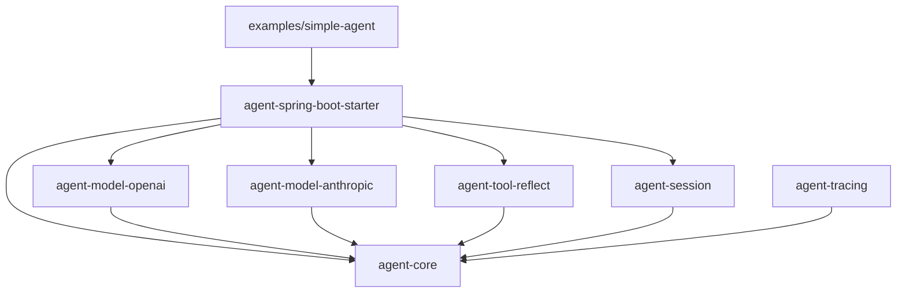

# Java Agents

[中文](README-ZH.md)

Java Agents is a lightweight Agent Runtime for Java 17 and Spring Boot 3. It provides agent definitions, model invocation, function tool execution, handoff and guardrail contracts, session storage, tracing, and Spring Boot auto-configuration.

Two model adapters are currently built in:

- OpenAI Chat Completions API;
- Anthropic Messages API.

`Runner` is decoupled from model providers and can complete the “model request → tool call → tool result → final text” loop within a single run.

> Inspired by [openai-agents-python](https://github.com/openai/openai-agents-python).

## Requirements

- JDK 17;
- Maven;
- An API key when calling a real model;
- Optional: `curl` for invoking the HTTP example.

```bash
java -version
mvn -version
```

Run all commands below from the repository root.

## Project Structure

```text
agent-java/
├── agent-core/                 # Core Agent Runtime contracts and Runner
├── agent-model-openai/         # OpenAI Chat Completions API adapter
├── agent-model-anthropic/      # Anthropic Messages API adapter
├── agent-tool-reflect/         # Annotation-based Java method tools
├── agent-session/              # In-memory and PostgreSQL session storage
├── agent-tracing/              # Span and tracing export contracts
├── agent-spring-boot-starter/  # Spring Boot auto-configuration
├── examples/simple-agent/       # OpenAI + reflection-tool HTTP example
└── pom.xml                      # Parent Maven project
```

| Module                                                    | Main responsibility                                                                     | Key types                                                            |
|-----------------------------------------------------------|-----------------------------------------------------------------------------------------|----------------------------------------------------------------------|
| [`agent-core`](agent-core/)                               | Agent, runner, model, tool, guardrail, session, tracing, and handoff contracts          | `Agent`, `Runner`, `ModelClient`, `Tool`, `TraceExporter`            |
| [`agent-model-openai`](agent-model-openai/)               | OpenAI Chat Completions requests, message parsing, tool calls, and message continuation | `OpenAIModelClient`                                                  |
| [`agent-model-anthropic`](agent-model-anthropic/)         | Anthropic Messages API requests, content blocks, tool calls, and message continuation   | `AnthropicModelClient`                                               |
| [`agent-tool-reflect`](agent-tool-reflect/)               | Generate tools, parameter schemas, and result-field descriptions from Java methods      | `ReflectionToolFactory`, `AgentTool`, `ToolParam`, `ToolResultField` |
| [`agent-session`](agent-session/)                         | In-JVM, PostgreSQL, and MySQL session message storage                                   | `InMemorySessionStore`, `PgSessionStore`, `MysqlSessionStore`        |
| [`agent-tracing`](agent-tracing/)                         | Tracing exporter implementations                                                        | `LogTraceExporter`                                                   |
| [`agent-spring-boot-starter`](agent-spring-boot-starter/) | Default OpenAI client, Runner, and configuration binding                                | `AgentsAutoConfiguration`, `AgentsProperties`                        |
| [`examples/simple-agent`](examples/simple-agent/)         | OpenAI client, Spring tool scanning, and HTTP entry point                               | `SimpleAgentApplication`, `AgentsConfiguration`, `TestTool`          |



## Quick Start

### 1. Build the Project

```bash
mvn clean install
```

This command builds all modules, runs the tests, and installs the `0.1.1-SNAPSHOT` artifacts into your local Maven
repository.

### 2. Configure and Start the Example

The example application explicitly registers `OpenAIModelClient` and reads its configuration through `AgentsProperties`:

```bash
export OPENAI_API_KEY="your-openai-api-key"
export OPENAI_MODEL="gpt-4.1-mini" # Optional
export OPENAI_BASE_URL="https://api.openai.com/v1/chat/completions" # Optional; overrides the complete default API URL
mvn -f examples/simple-agent/pom.xml spring-boot:run
```

The application listens on port `8080` by default. If `OPENAI_MODEL` is not set, it uses `gpt-4.1-mini`.

### 3. Invoke the Agent

Open [http://127.0.0.1:8080/](http://127.0.0.1:8080/) in a browser to use the built-in debugging page for multi-turn conversations and inspect the `sessionId`, `runId`, turn count, request latency, and latest raw response.

You can also call the endpoint directly:

```bash
curl -X POST http://localhost:8080/agents/run \
  -H 'Content-Type: application/json' \
  --data '{"input":"Fetch the news list, then introduce the first article","sessionId":"demo-session"}'
```

The example registers `get_news` and `news_detail` from `TestTool` with the Agent. The model can request a tool call; Runner executes it and continues the model request. The HTTP response is:

```json
{
  "finalOutput": "...",
  "runId": "550e8400-e29b-41d4-a716-446655440000",
  "sessionId": "demo-session",
  "turns": 1,
  "usage": {
    "inputTokens": 120,
    "outputTokens": 35,
    "totalTokens": 155,
    "cachedInputTokens": 64,
    "reasoningTokens": 12
  }
}
```

`runId` is a UUID generated for each run. `turns` is the number of actual model calls. `usage` accumulates token usage across every model call in the run, including tool continuation and the finalization request after reaching the turn limit. A field is `0` when the provider does not return that usage value.

## Using It from Java

### Dependencies

First run `mvn clean install`. A regular Java application needs at least the core module and one model adapter:

```xml
<dependencies>
    <dependency>
        <groupId>com.ariza.agent</groupId>
        <artifactId>agent-core</artifactId>
        <version>0.1.1-SNAPSHOT</version>
    </dependency>
    <dependency>
        <groupId>com.ariza.agent</groupId>
        <artifactId>agent-model-openai</artifactId>
        <version>0.1.1-SNAPSHOT</version>
    </dependency>
</dependencies>
```

To use Anthropic, replace the second artifact ID with `agent-model-anthropic`.

### Define and Run an Agent

```java
import com.ariza.agent.core.Agent;
import com.ariza.agent.core.RunResult;
import com.ariza.agent.core.Runner;
import com.ariza.agent.core.model.ModelClient;
import com.ariza.agent.openai.OpenAIModelClient;

public class AgentExample {
    public static void main(String[] args) {
        ModelClient modelClient =
                new OpenAIModelClient(System.getenv("OPENAI_API_KEY"));

        Agent agent = Agent.builder()
                .name("Assistant")
                .instructions("You are a helpful assistant.")
                .model("gpt-4.1-mini")
                .build();

        RunResult result = new Runner(modelClient).runAgent(agent, "Introduce the Java Agent Runtime");
        System.out.println(result.finalOutput());
    }
}
```

`Agent.name`, `Agent.instructions`, and `Agent.model` must not be empty. Unset or `null` values for `tools`, `handoffs`, and `guardrails` are converted to immutable empty lists.

Runner's default `maxTurns` is `10`, and it can be set to any positive integer. If tool calls are still present when the limit is reached, Runner makes one additional tool-disabled finalization request so the model can produce a final response from the available information. A request for an unknown tool fails.

## Tool Calls

### Runner Execution Flow

1. Create a unique `RunContext` for the run.
2. Send the user text, Agent instructions, model name, and tool definitions to `ModelClient`.
3. When the model returns tool calls, locate and execute each `Tool` by name.
4. Wrap a successful result or failure description in `ToolOutput`.
5. Continue the model call with the same `RunContext` and provider continuation.
6. Create a `RunResult` after the model returns plain text.

A tool failure does not immediately stop the loop. Runner returns `Tool execution failed: ...` to the model. An unknown tool causes an exception. The finalization request after `maxTurns` declares no tools and asks the model not to expose the internal turn limit. It counts toward `RunResult.turns`; if the model produces no summary text, previously generated text is retained.

### Declare Tools with Annotations

Add the reflection tool module:

```xml
<dependency>
    <groupId>com.ariza.agent</groupId>
    <artifactId>agent-tool-reflect</artifactId>
    <version>0.1.1-SNAPSHOT</version>
</dependency>
```

```java
import com.ariza.agent.core.RunContext;
import com.ariza.agent.tool.reflect.AgentTool;
import com.ariza.agent.tool.reflect.ToolFieldFormat;
import com.ariza.agent.tool.reflect.ToolParam;
import com.ariza.agent.tool.reflect.ToolResultField;

public final class NewsTools {
    /** Queries news details. */
    @AgentTool(name = "news_detail", description = "Query news details")
    public News detail(
            @ToolParam(value = "title", description = "News title") String title,
            RunContext context) {
        context.attributes().put("lastTitle", title);
        return new News(title, "Content");
    }

    public record News(
            @ToolResultField(description = "Title", hasValue = true) String title,
            @ToolResultField(
                    description = "Publication time",
                    format = ToolFieldFormat.DATE_TIME) String publishedAt) {
    }
}
```

```java
var tools = new ReflectionToolFactory().create(new NewsTools());
var agent = Agent.builder()
        .name("News assistant")
        .instructions("Query news when necessary")
        .model("claude-sonnet-4-20250514")
        .tools(tools)
        .build();
```

Rules:

- `@AgentTool.description` is required; the method name is used when `name` is empty.
- Except for an unannotated `RunContext`, every parameter must use `@ToolParam`.
- A parameter with `required = false` cannot use a Java primitive type.
- Parameters generate a JSON Schema with `additionalProperties: false`.
- Regular return values are converted to JSON by Jackson; methods may also return `ToolResult` directly.
- `@ToolResultField` can declare a description, required value, format, and allowed values. The generated result JSON Schema is appended to the tool description.
- `ToolFieldFormat` supports common formats including date-time, URI, email, IP, UUID, numeric, and binary values.

`examples/simple-agent` scans Spring beans containing methods annotated with `@AgentTool` and detects duplicate tool names across beans. This scanning logic belongs to the example's `AgentsConfiguration`; it is not part of Starter auto-configuration.

## Model Adapters

### OpenAI

`OpenAIModelClient` calls `https://api.openai.com/v1/chat/completions` by default and supports:

- Chat Completions message serialization and text output;
- function tool definitions and tool-call parsing;
- tool-result continuation through accumulated messages;
- finish reasons, cached and reasoning tokens, non-2xx responses, invalid responses, and thread interruption handling.

```java
ModelClient client = new OpenAIModelClient(System.getenv("OPENAI_API_KEY"));
```

### Anthropic

`AnthropicModelClient` calls `https://api.anthropic.com/v1/messages` by default and supports:

- Messages API text content blocks;
- client tool definitions, `tool_use` parsing, and parallel `tool_result` submission;
- conversation continuation through native message history;
- stop reasons, cached and reasoning tokens, non-2xx responses, invalid responses, and thread interruption handling.

```java
ModelClient client = new AnthropicModelClient(System.getenv("ANTHROPIC_API_KEY"));
```

The default `max_tokens` is `4096`; configure it with `new AnthropicModelClient(apiKey, maxTokens)`.

Both clients offer constructors accepting an injectable `URI`, `HttpClient`, and `ObjectMapper` for custom endpoints and testing. The API key must not be empty.

## Spring Boot Integration

```xml
<dependency>
    <groupId>com.ariza.agent</groupId>
    <artifactId>agent-spring-boot-starter</artifactId>
    <version>0.1.1-SNAPSHOT</version>
</dependency>
```

The Starter provides the following through `@ConditionalOnMissingBean`:

- `ModelClient`: `OpenAIModelClient` by default;
- `SessionStore`: `InMemorySessionStore` by default;
- `Runner`: uses the container's `ModelClient` and `SessionStore`, and registers the client as the static default for `Runner.run(...)`.

```yaml
agents:
  ai:
    api-key: ${OPENAI_API_KEY:}
    default-model: gpt-4.1-mini
    endpoint: ${OPENAI_BASE_URL:}
  session:
    type: memory
```

`default-model` is only a type-safe configuration property; the Starter does not create an Agent automatically.
Applications must read it and set `Agent.model` themselves. `endpoint` optionally overrides the default OpenAI client
URL. For a custom Anthropic client bean, override the API URL through its constructor.

Registering a custom `ModelClient` bean replaces the default OpenAI implementation. The example explicitly registers
`OpenAIModelClient`. If an application also provides its own `Runner`, it must decide whether to call
`Runner.setDefaultModelClient`; the instance method `runAgent` does not depend on the static default client.

When `agents.ai.api-key` is missing or blank, the Starter does not create the default `OpenAIModelClient` or `Runner`,
and the application can still start normally. You can register your own `ModelClient` bean, and the Starter will create
a default `Runner` from it.

### Integration and Performance Recommendations

After adding `agent-spring-boot-starter`, treat an Agent as a constrained business orchestrator instead of allowing the
model to explore every tool freely. For latency-sensitive query endpoints:

- Create a dedicated `Agent` for each task and select only the necessary tools from `AgentTools.getTools()`. More tools increase selection cost, incorrect calls, and extra-turn risk.
- State business routing, tool-call limits, and termination conditions explicitly in `instructions`. For example, imagery search should call its primary query tool exactly once and summarize immediately, rather than serially querying satellite, sensor, and data metadata.
- Distinguish series-level intent from an exact model condition. When a user mentions only a satellite series, pass a series or prefix condition and let the business query layer expand matching sensors. Use metadata tools for exact completion only when a satellite or sensor is explicitly identified; do not make the model guess.
- Apply both prompt constraints and server-side validation to JSON and other structured output. Specify exact array, enum, and date types in the instructions; before deserialization, tolerate known variations and reject unknown values. Always treat model output as untrusted input.
- Reuse the singleton `ModelClient`, `Runner`, and `SessionStore` registered by the Starter. If a subtask does not need conversation history, pass a `null` session ID to avoid contaminating the main session.
- Use `RunContext.attributes()` to carry hit status, candidate records, and other run-scoped state. Reuse this state in post-processing instead of repeating queries for links, titles, or messages.
- Run independent post-processing operations in parallel and implement deterministic operations in Java. Title truncation, URL encoding, and fixed-link generation do not need another model call. When a model must select candidates, limit the candidate set and verify that returned IDs belong to it.
- Execute Agents on a dedicated thread for SSE endpoints and explicitly propagate request context when necessary. Tool decoration can report `querying` and `analyzing` stages without changing every business tool. Handle client disconnects, progress-delivery failures, and primary-flow failures separately.
- Record primary-flow, post-processing, and total latency together with `RunResult.turns()`. Optimize redundant model turns and serial tool calls before tuning individual query latency.
- Endpoint tests should assert core business outcomes, such as pagination `total > 0`, rather than HTTP 200 alone. Add structured-output cases for single values, arrays, numeric strings, and enum names.

### PostgreSQL Session Storage

PostgreSQL storage does not require JPA. A MyBatis application can reuse its existing data source; make sure the PostgreSQL driver is present:

```xml
<dependency>
    <groupId>org.postgresql</groupId>
    <artifactId>postgresql</artifactId>
    <scope>runtime</scope>
</dependency>
```

Select `pg` in `application.yml` and configure the data source as usual for the MyBatis application:

```yaml
agents:
  session:
    type: pg

spring:
  datasource:
    url: jdbc:postgresql://localhost:5432/agents
    username: postgres
    password: ${POSTGRES_PASSWORD}
```

`PgSessionStore` reuses the `DataSource` and JDBC transactions configured by MyBatis/Spring and does not depend on JPA.
Before enabling it for the first time, run [
`agent_session_messages.sql`](agent-session/src/main/resources/db/postgresql/agent_session_messages.sql) to create the
table and indexes, or include the script in Flyway or Liquibase. A user-defined `SessionStore` bean takes precedence
over the built-in implementation.

### MySQL Session Storage

Add the MySQL driver:

```xml
<dependency>
    <groupId>com.mysql</groupId>
    <artifactId>mysql-connector-j</artifactId>
    <scope>runtime</scope>
</dependency>
```

Configure the data source and select `mysql`:

```yaml
agents:
  session:
    type: mysql

spring:
  datasource:
    url: jdbc:mysql://localhost:3306/agents?connectionTimeZone=UTC
    username: root
    password: ${MYSQL_PASSWORD}
```

Before enabling it for the first time, run the MySQL version of [
`agent_session_messages.sql`](agent-session/src/main/resources/db/mysql/agent_session_messages.sql). Set the JDBC
connection time zone to UTC to prevent `Instant` offsets during reads and writes. A user-defined `SessionStore` bean
takes precedence over the built-in implementation.

## Agent Tracing

`Runner` accepts an optional `TraceExporter`. Without one, no spans are created or exported. When configured, the runner
automatically exports `agent.run`, `model.call`, and `tool.call` parent-child spans. Model spans include inputs,
outputs, tool requests, and token usage. Tool spans include the turn, call order, arguments, result, and failure stage.
Calls left unexecuted at the turn limit are recorded as `skipped`. Export failures are logged as warnings and do not
interrupt the agent run.

Each run also exports ordered `TraceEvent` records with a strictly increasing `sequence`, covering the `RUN_*`,
`MODEL_*`, and `TOOL_*` lifecycles. `TOOL_REQUESTED` is paired by `callId` with `TOOL_COMPLETED`, `TOOL_FAILED`, or
`TOOL_SKIPPED`. The default `LogTraceExporter` writes spans as `agent span` log entries and events as `agent event`
entries. Implement `TraceExporter.exportEvent` to persist or replay them elsewhere.

Trace data can contain sensitive user input, tool arguments, and tool results. Production exporters should redact and
truncate this data before storing it.

Add the logging exporter:

```xml
<dependency>
    <groupId>com.ariza.agent</groupId>
    <artifactId>agent-tracing</artifactId>
    <version>0.1.1-SNAPSHOT</version>
</dependency>
```

Pass it directly in a non-Spring application:

```java
Runner runner = new Runner(modelClient, sessionStore, new LogTraceExporter());
```

In Spring Boot, declare a `TraceExporter` bean and the starter-created `Runner` will use it automatically:

```java
@Bean
TraceExporter traceExporter() {
    return new LogTraceExporter();
}
```

## Capabilities Not Yet Orchestrated Automatically

The following modules or contracts exist, but the current `Runner` does not invoke them automatically:

- `Handoff`: task handoff description;
- `Guardrail`: actions including `ALLOW`, `BLOCK`, `REWRITE`, `RETRY`, and `HUMAN_APPROVAL_REQUIRED`.

`InMemorySessionStore` is suitable only for single-process development and testing; its data is lost when the JVM exits. Use `PgSessionStore` or `MysqlSessionStore` when persistence or cross-instance sharing is required.

## Build and Test

```bash
# Full verification
mvn clean verify

# All unit tests
mvn test

# A selected module and its dependencies
mvn -pl agent-core -am test
mvn -pl agent-model-anthropic -am test
mvn -pl agent-tool-reflect -am test

# Install SNAPSHOT artifacts into the local Maven repository
mvn clean install
```

Current shared versions:

- Project: `0.1.1-SNAPSHOT`;
- Java release: `21`;
- Spring Boot: `3.5.8`;
- Maven Compiler Plugin: `3.14.1`;
- Maven Surefire Plugin: `3.5.4`.

## Security

- Inject API keys only through environment variables or a secure secrets facility.
- Never write real keys into source code, configuration, tests, logs, or commit history.
- Verify custom endpoints before use. The clients send the key in the Bearer Authorization request header.
- Tools execute inside the application process. Validate model arguments and restrict permissions to prevent unvalidated commands, queries, or external side effects.
- `InMemorySessionStore` is not appropriate for sensitive sessions that require persistence, cross-instance sharing, or strict access control.

## Version and License

The current version is `0.1.1-SNAPSHOT`, and the API may still change. This repository currently uses the MIT License.
